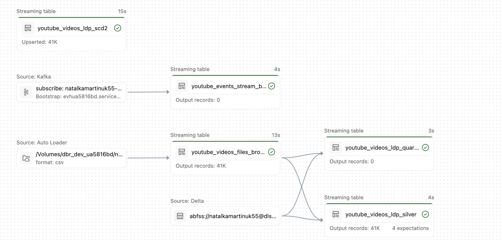
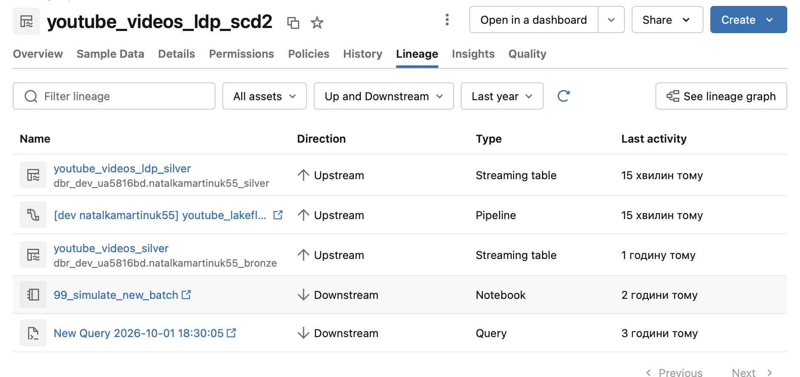
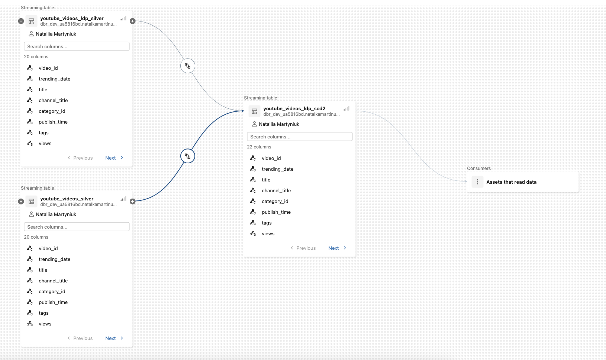

# Lab 5 — Lakeflow Declarative Pipelines
 
## Pipeline Sources
 
* **Streaming**: `youtube_events_stream_bronze` — via Kafka-compatible Event Hub subscription (`natalkamartinuk55-stream-hub`), reusing the producer/consumer setup built in Lab 3.
* **Batch/incremental**: `youtube_videos_files_bronze` — via Auto Loader (`cloudFiles`) over the `raw_data` volume (`USvideos.csv`), since new trending snapshots arrive as files rather than as a continuous stream.
## Design Highlights
 
* **Bronze**: append-only (`delta.appendOnly=true`), `pipelines.reset.allowed=false`, schema evolution mode `addNewColumns`. All columns are ingested as `string` (`cloudFiles.inferColumnTypes=false`) so a malformed value can never break ingestion — typing is deferred to silver, where it happens under controlled conditions.
* **Silver + Data Quality**: casts and types the columns, then `expect_all_or_drop` validates `views`, `likes`, `dislikes`, `comment_count`. A dedicated `youtube_videos_ldp_quarantine` table captures every rejected row (built from the same shared cleaning logic as silver, so the two tables can never disagree on what counts as "valid") — rejected records are preserved for investigation instead of being silently dropped.
* **SCD Type 2**: `create_auto_cdc_flow` tracks the full history of `views`, `likes`, `dislikes`, `comment_count` per `video_id`, sequenced by `(trending_date, _silver_processed_at)`. This replaces the ~40-line manual two-step `MERGE` written by hand in Lab 4 with an 11-line declarative call.
* **Lineage**: visible end-to-end in Catalog Explorer → table → **Lineage** tab, including the bronze→silver schema boundary and column-level detail.
* **Deployment**: Databricks Asset Bundle (`youtube_lakeflow`) with `dev`/`prod` targets — catalog, schema, and volume paths are all variables, not hardcoded. `dev` has been deployed and run successfully; `prod` has been validated (`databricks bundle validate -t prod`) but not deployed, since the pipeline is still under active development.
---
 
## Task 5 — Declarative Pipelines vs. Classic Spark Pipelines
 
This comparison is grounded in direct experience: the same business logic (YouTube video ingestion, cleaning, and SCD Type 2 history) was first built the classic way in Lab 4, then rebuilt declaratively here.
 
| Dimension | Classic Spark (Lab 3–4) | Declarative Pipeline (Lab 5) |
|---|---|---|
| **Orchestration** | Manual: `%run ./00_config`, notebooks executed in a fixed, hand-maintained order (`00` → `01` → `02`) | Automatic: `@dp.table` registers each dataset; Lakeflow builds the dependency graph and decides execution order itself |
| **Checkpointing** | Manual: every `readStream`/`writeStream` call needs an explicit `checkpointLocation` | Fully managed internally — never referenced in the code |
| **SCD Type 2** | ~40 lines: `row_number()`/`Window` dedup, an `if/else` branch for first-run vs. later runs, a two-step `MERGE` (close old version → insert new) | 11 lines: `create_streaming_table()` + `create_auto_cdc_flow(keys=, sequence_by=, stored_as_scd_type=2, track_history_column_list=)` |
| **Data quality** | Manual `.filter()`; rows that fail are silently dropped, with no visibility into how many or why | `@dp.expect_all_or_drop()` with named rules; per-rule pass/fail counts are visible in the pipeline UI, plus a dedicated quarantine table |
| **Lineage** | Nothing built-in — would require a hand-drawn diagram | Automatic graph in Catalog Explorer, down to column-level detail |
| **Safe reload** | A `.write.mode("overwrite")` simply runs — no built-in protection against accidental data loss | `table_properties` enforce `pipelines.reset.allowed` and `delta.appendOnly`; an unauthorized Full Refresh is actively blocked |
| **Deployment** | Click through the UI to attach a cluster and create notebook jobs by hand | One Asset Bundle (`databricks.yml` + `pipeline.yml`), `dev`/`prod` targets, reproduced anywhere with `bundle deploy` + `bundle run` |
| **Debugging** | Straightforward — a notebook cell fails, the Python traceback is right there | Harder — failures surface as Spark Structured Streaming internals (e.g. `DIFFERENT_DELTA_TABLE_READ_BY_STREAMING_SOURCE`), and several flows can retry or restart independently, which makes the root cause less visible |
| **Flexibility** | Full control — any Python/Spark logic is possible, including one-off or unusual transformations | Bounded by the framework's supported patterns (`@dp.table`, `@dp.expect*`, `create_auto_cdc_flow`); anything outside those patterns still needs classic code |
 
### Operational simplicity vs. flexibility
 
The declarative approach wins decisively on everyday operational tasks: data quality, SCD history, and lineage that took dozens of hand-written lines and zero built-in visibility in Lab 4 are now a few decorator arguments with full observability in the UI. The trade-off showed up directly during testing: when a test file briefly corrupted Auto Loader's internal backlog, recovering it required deliberately lifting two independent safety properties (`pipelines.reset.allowed`, `delta.appendOnly`) rather than just re-running a cell, as would be possible in the classic notebooks. The framework trades some of that fine-grained control for guardrails that make accidental data loss much harder — a reasonable trade for a production pipeline, less convenient for rapid, throwaway experimentation.
 
### Cost considerations
 
This pipeline runs on **serverless** compute (`serverless: true`), so cost scales with actual usage rather than a cluster sitting idle between runs — appropriate for a pipeline triggered on a schedule rather than continuously. The classic notebooks in Lab 3–4, by contrast, required manually attaching and detaching a cluster, with the usual risk of leaving it running unused. The trade-off is that serverless compute policies are controlled by the workspace administrator and may be unavailable or restricted in shared academy environments.
 
---
 
## Task 4 — Safe Reload
 
* Confirmed that `pipelines.reset.allowed=false` and `delta.appendOnly=true` correctly **block** an unauthorized Full Refresh attempt — both failed with explicit, descriptive errors rather than silently succeeding.
* Performed a **controlled, intentional** recovery after a test file corrupted Auto Loader's backlog: both protections were temporarily lifted, a scoped Full Refresh was run on the affected bronze table only, and both protections were restored immediately afterward.
* Verified SCD Type 2 correctness against the dataset's own historical `trending_date` snapshots for `video_id = '-0CMnp02rNY'`: **6 versions**, each closed (`__END_AT` populated) except the most recent, which remains open (`__END_AT = NULL`) — exactly the expected SCD2 behavior.
---
 
## Screenshots
 
> Save each screenshot below into a `screenshots/` folder next to this README, using the filenames shown, and they will render here automatically.
 
**Lineage — full pipeline graph** (bronze → silver → quarantine → scd2, with Output records and expectation counts)

 
**Lineage — `youtube_videos_ldp_silver`** (upstream/downstream list view, Catalog Explorer)

 
**Lineage — column-level detail** (bronze raw columns → typed silver columns)

 
---
 
## Execution Status
 
Bundle validated and deployed successfully to `dev`. Pipeline runs end-to-end (streaming + batch bronze → silver → quarantine → scd2) with passing expectations and visible lineage. `prod` target validated only, not deployed.
 