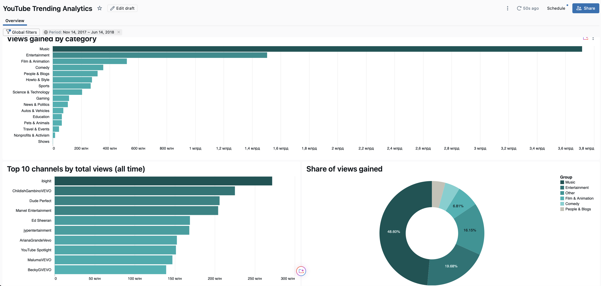
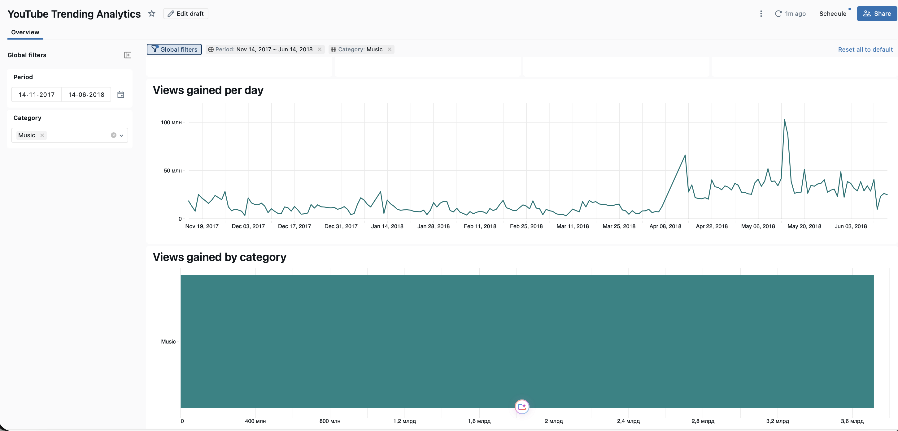
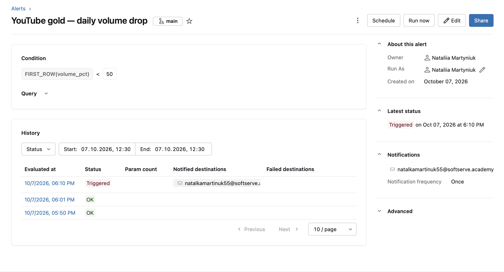

# Lab 6: Gold Layer and Business Analytics

## Overview

This lab builds the gold layer on top of the YouTube trending silver table and presents
the data from a business perspective:

- a **star schema** (dimensions, fact, aggregates) built with idempotent, config-driven notebooks;
- an **AI/BI dashboard** with global filters;
- a **Genie space** for natural-language Q&A over the gold layer;
- an **alert** that fires and sends an email when the daily data volume drops;
- **governance**: object grants, row-level security and column-level security.

| | |
|---|---|
| Catalog | `dbr_dev_ua5816bd` |
| Source (silver) | `natalkamartinuk55_silver.youtube_videos_ldp_silver` |
| Gold schema | `natalkamartinuk55_gold` |
| Data period | 2017-11-14 – 2018-06-14 (US trending videos) |

**Grain of the fact table:** one row per video per trending day (periodic snapshot).

| Table | Type | Key | Notes |
|---|---|---|---|
| `dim_category` | static reference | `category_id` (natural) | The CSV has only numeric codes, so the YouTube US code → name mapping is a hand-maintained reference table |
| `dim_channel` | dimension | `channel_key` (surrogate, `IDENTITY`) | The source has no stable channel id, only the title |
| `dim_video` | dimension, SCD Type 1 | `video_id` (natural) | Latest attributes win (title and tags can change while a video is trending) |
| `dim_date` | generated calendar | `date_key` (`yyyyMMdd`) | Generated from the min to the max `trending_date` |
| `fact_video_daily_stats` | periodic snapshot fact | (`video_id`, `date_key`) | FKs to all four dimensions |
| `agg_category_daily` | aggregate | (`category_id`, `date_key`) | Videos in trending, views gained, like rate per category and day |
| `agg_channel_summary` | aggregate | `channel_key` | Videos trended, average days in trending, total views per channel |

All tables have column and table comments, primary keys and (on the fact) foreign keys.
In Databricks PK/FK constraints are informational: they document the model for people, BI tools and Genie.

### Metric design: cumulative views

`views`, `likes`, `dislikes` and `comment_count` in the source are **cumulative snapshots**, so they are
**semi-additive**: they can be summed across videos on one day, but never across days for the same video
(a video trending for 7 days would be counted 7 times). To handle this:

- `views_delta` = views gained since the previous trending day of the same video (`LAG` window function).
  It is **additive** and is used for "views gained in a period". It is `NULL` on a video's first trending day,
  because the views before the video entered trending are unknown.
- `agg_channel_summary.total_views` uses a **two-step aggregation**: `MAX(views)` per video, then `SUM` per channel.
- `like_rate` = `SUM(likes) / SUM(views)` (weighted), never an average of per-row ratios.

## Components

| File | Purpose |
|---|---|
| `gold_config.yml` | Catalog, schemas and table names for `dev` and `prod` |
| `00_config` | Loads the config for the selected environment (`env` widget) and builds full table names. Other notebooks use `%run ./00_config` |
| `01_gold_ddl` | Creates the gold schema and all tables (`CREATE TABLE IF NOT EXISTS`) with types, comments, PK/FK. Safe to rerun, never drops data |
| `02_gold_dimensions` | Loads the four dimensions with `MERGE` (insert-only for channel/date, SCD1 update for video) |
| `03_gold_facts` | Deduplicates silver to the fact grain (`ROW_NUMBER`), looks up `channel_key`, computes `views_delta` and `trending_day_num`, validates that no key is `NULL`, then `MERGE`s into the fact |
| `04_gold_aggregates` | Rebuilds the aggregates from the star schema with `INSERT OVERWRITE` (atomic full recompute) |
| `05_volume_alert` | Sandbox for the alert demo, the volume metric, the drop simulation and the recovery |
| `06_governance` | Grants, `access_rules` table, row filter and column mask, with before/after tests |
| `YouTube Trending Analytics.lvdash.json` | AI/BI dashboard |

**Run order:** `01_gold_ddl` → `02_gold_dimensions` → `03_gold_facts` → `04_gold_aggregates` → `06_governance`.

## Dashboard

**YouTube Trending Analytics** (AI/BI), teal single-hue palette.

| Widget | Dataset |
|---|---|
| KPI counters: videos in trending, views gained, channels, like rate | `trending_videos` (fact joined to all dimensions) |
| Line chart: views gained per day | `agg_category_daily` |
| Bar chart: views gained by category (color gradient by value) | `agg_category_daily` |
| Bar chart: top 10 channels by total views (all time) | `top_channels` (from `agg_channel_summary`) |
| Donut: share of views gained, top 5 categories + Other | `category_share` (from `agg_category_daily`) |

**Global filters:** `Period` (date range, default = real data period) and `Category`.

`like_rate` is a dashboard custom calculation (`SUM(likes) / SUM(views)`), so it is recomputed correctly
for any filter selection. Unique videos and channels use `COUNT DISTINCT` on the fact, because the
aggregate counts a video once per day.

The dashboard is published with **individual data permissions**, so every viewer's queries run with
their own permissions and the row filter and column mask are enforced per viewer.

## Genie space

A Genie space over the 7 gold tables, with:

- **instructions** describing the star schema and the metric rules (cumulative views, `views_delta`,
  weighted like rate, `COUNT DISTINCT` for videos, default date range);
- **example SQL queries** for views gained by category, like rate by category and top videos;
- **sample questions** for users.

Test of the tricky question *"How many views did Music get in March 2018?"*: Genie used
`SUM(views_gained)` from `agg_category_daily` joined to `dim_date` (not `SUM(views)`), which shows that
the instructions and the documented model work.

## Alert

**Metric:** `volume_pct` = rows on the latest day / average rows over the previous 7 days × 100.
A relative threshold adapts to the normal volume, unlike a fixed row count.

**Condition:** `volume_pct < 50` (volume dropped by more than half). The alert runs every hour and sends
an email once, until the status returns to OK.

**Simulation:** done on `fact_volume_sandbox`, a copy of the fact for the real period, so the production
gold tables, dashboard and Genie are not affected:

1. Normal data: `volume_pct ≈ 100` → **OK**.
2. A new day (2018-06-15) is inserted with only 5 rows (a normal day has ~200) → `volume_pct ≈ 2.5` → **TRIGGERED**.
3. The simulated rows are deleted → **OK** again.

## Governance

**Object permissions.** `account users` get `USE SCHEMA` on the gold schema and `SELECT` on each business
gold table, granted table by table (least privilege). Service tables (`access_rules`,
`fact_volume_sandbox`) are not granted.

Note: in this training workspace the `students` group has `ALL PRIVILEGES` on the whole catalog, which is
inherited by every table and cannot be restricted at table level. In production, catalog-level grants
would be limited to `USE CATALOG`, and data access would be granted per schema and table.

**Entitlement table.** Workspace groups can only be created by an admin, so access rules are stored in
`access_rules` (`user_email`, `allowed_category_id` where `NULL` means all categories, `can_see_dislikes`).
Rules are changed by updating data, not code. Users without a rule see nothing (**deny by default**).

**Row-level security.** The row filter `rls_category_filter` (uses `current_user()`) is set on
`category_id` of `fact_video_daily_stats` **and** `agg_category_daily`, so the restriction cannot be
bypassed through the aggregate.

**Column-level security.** The column mask `cls_mask_dislikes` is set on `fact_video_daily_stats.dislikes`.
Users without `can_see_dislikes` get `NULL`. The mask is applied before aggregation, so `SUM(dislikes)` is
also `NULL` and cannot leak the values.

**Verification.** The same queries were run before and after changing the current user's rule:
all 16 categories → only Music, real dislikes → `NULL`. The dashboard and Genie showed only Music too.

## Known limitations

- **No stable channel id** in the source: a renamed channel would become a new row in `dim_channel`.
  With a `channel_id` from the YouTube API the MERGE would match on it and apply SCD Type 1 to the title.
- **Synthetic test row:** silver contains one row dated 2026, created by `99_simulate_new_batch` in Lab 5.
  Gold keeps it as-is (it reflects silver faithfully). The dashboard default period, the Genie instructions
  and the alert sandbox use the real period only.
- `agg_channel_summary` has no category column, so the row filter is not applied to it.
- The fact load reads the whole silver table on each run; `MERGE` writes only changes. At large scale only
  new silver rows would be processed (for example by `_silver_processed_at` or Change Data Feed).
- Dashboard and alert queries use full `dev` table names (dashboards and alerts do not use the notebook config).
